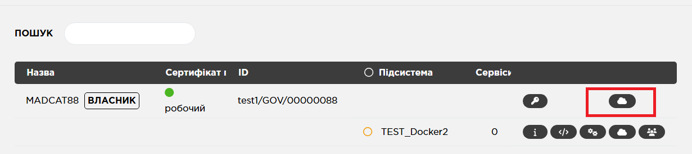

# Trembita 2.0 Helm Chart

Даний Helm Chart призначений для розгортання Шлюзу Безпечного Обміну (ШБО) **Trembita 2.0** версії 1.22.6 в Kubernetes-оточенні.

---
Helm-чарт використовує наступні сутності Kubernetes:

| Компонент                | Опис                                              | Документація                                   |
|--------------------------|---------------------------------------------------|------------------------------------------------|
| ConfigMap                | Конфигурационные файлы                            | [ConfigMap](docs/ConfigMaps.md)                |
| Shared Volumes           | Постоянные хранилища, доступные из нескольких Pod | [Shared Volumes](docs/sharedVolumes.md)        |
| Ephemeral RAM Volumes    | Временные тома в оперативной памяти               | [Ephemeral Volumes](docs/ephemeralVolumes.md)  |
| Persistent Storage       | Постоянное хранилище, доступное только одному Pod | [Persistent Storage](docs/persistentVolume.md) |

## 1. Підготовка до встановлення

Перед встановленням необхідно зробити наступні кроки:

### 1.1 Налаштуваня StorageClass з підтримкою ReadWriteMany

Перед встановленням необхідно переконатись що в кластері доступно сховище з підтримкою **ReadWriteMany (RWX)**. Це необхідно для коректної роботи shared volumes між подами.

> Рекомендований та протестований провайдер - **Longhorn**.

Якщо використовується Longhorn, але ще не налаштовано  RWX StorageClass, можна використовувати наступний приклад [StorageClass](https://github.com/kshypachov/trembita_v2.0_docker/blob/main/longhorn_rwm_storege_class.yaml) з відповідного репозиторію.

---

### 1.2 Збірка Docker-образів

В чарті використовуються попередньо зібрані Docker-образи, які розміщені в публічних Docker Registry. **Наполегливо рекомендується перезібрати їх самостійно та завантажити в внутрішній Docker-реєстр.**

Вихідні Dockerfile знаходяться в репозиторії:

```
https://github.com/kshypachov/trembita_v2.0_separate_components_docker.git
```

---

### 1.3 Налаштування DNS-інфраструктури

Всі компоненти ШБО доступні лише за **DNS-іменами**. Необхідно переконатись що у внутрішній мережі налаштовано DNS-сервер та дозволені доменні імена.

---

### 1.4 Підтримка HTTPS passthrough для mutual TLS (опціонально)

Якщо ваші веб-клієнти повинні використовувати **взаємну HTTPS-автентифікацію**, необхідно переконатись що відповідний Ingress-контролер підтримує passthrough:

```yaml
nginx.ingress.kubernetes.io/ssl-passthrough: "true"
```
### 1.5 Завдання пароля для програмного токена

Паролі від токенів задаються в `env` змінній оточення в секції  `trembita_proxy_pod:`:

```yaml
UXP_TOKENS_PASS: "<token-ID>:<password>"
```
де: <token-ID> - ідентифікатор токену;
<password> - пароль.

При використанні декількох токенів вони вказуються через знак `,` без пробілів між ними:

```yaml
UXP_TOKENS_PASS: "<token-ID1>:<password1>,token-ID2>:<password2>"
```

Програмний токен, який створюється при ініціалізації ШБО має ідентифікатор `0`, тобто пароль для нього буде задаватись наступним чином:
```yaml
UXP_TOKENS_PASS: "0:12345"
```
### 1.6 Налаштування розміру сховища PostgreSQL

Зазвичай для сховища PostgreSQL достатньо 5 ГБ при відправці транзакцій с сховищі S3 і очищенні локального сховища.

```yaml
trembita_postgresql_pod.persistentStorage.size: 5Gi
```

### 1.7 sharedVolumes

Спільні тома, які підключаються до декільких Pod: 

- `etc-uxp-globalconf`, `etc-uxp-signer` — копіюються з образу на етапі ініціалізації.
- `var-lib-uxp-messagelog` — містить транзакції та тимчасові файли.  
> **Важливо!** Не можна змінювати параметри `initCopy`, `mountPath`, `storageClassName`.

### 1.8 Сховище MinIO

Сховище MinIO налаштовано як окремий модуль (Bitnami Helm chart).

БІльш детальний опис наведено тут: https://artifacthub.io/packages/helm/bitnami/minio

Приклад конфігурації сховища:

```yaml
minio:
  fullnameOverride: minio
  auth:
    rootUser: minioadmin
    rootPassword: minioadmin
  defaultBuckets: uxp-messagelog
  mode: standalone
  persistence:
    enabled: true
    size: 1Gi
  ingress:
    enabled: true
    ingressClassName: "nginx"
    hostname: minio.trembita.office
  apiIngress:
    enabled: true
    ingressClassName: "nginx"
    hostname: api.minio.trembita.office
```

---

## 2. Встановлення Helm-чарта

Встановлення Helm-чарта буде розглянуто на прикладі додатку ArgoCD.
Для встановлення необхідно виконати наступні кроки:

### 2.1 Клонування репозиторію

```bash
git clone https://github.com/kshypachov/trembita_v2.0_docker.git
```

---

### 2.2 Попередні налаштування

Всі налаштування проводяться в файлі values.yaml

```
trembita-1-22-6-ss/values.yaml
```
Необхідно виконати наступні налаштування:

#### 2.2.1 Оновити наступні параметри:

> **Важливо!**: Всі образи, які вказані нижче, рекомендовано перезібрати та опублікувати в внутрішньому Docker-реєстрі.

| Параметр                                                        | Образ                          | Призначення                                                                        |
|-----------------------------------------------------------------|--------------------------------|------------------------------------------------------------------------------------|
| `trembita_config.init_jobs.trembita_postgres.image`             | db_init_container              | Ініціалізація бази даних                                                           |
| `trembita_config.init_jobs.trembita_volumes.image`              | uxp-main                       | Створення структури файової системи                                                |
| `trembita_config.trembita_configuration_client_pod.image`       | uxp-configuration-client       | Служба завантаження глобальної конфигурації з джерел вказаних в якорі конфигурації |
| `trembita_config.trembita_message_log_archiver_pod.image`       | uxp-message-log-archiver       | Архивировування транзакцій в файлову систему або s3-сховище                        |
| `trembita_config.trembita_identity_provider_rest_api_pod.image` | uxp-identity-provider-rest-api | API OAuth авторизація користувачів веб-інтерфейсу                                  |
| `trembita_config.trembita_ocsp_cache_pod.image`                 | uxp-ocsp-cache                 | Кешування OCSP відповідей                                                          |
| `trembita_config.trembita_verifier_pod.image`                   | uxp-verifier                   | Перевірка транзацій                                                                |
| `trembita_config.trembita_seg_rest_api_pod.image`               | uxp-seg-rest-api               | REST API для керування ШБО Trembita 2.0                                            |
| `trembita_config.trembita_proxy_pod.image`                      | uxp-proxy                      | Обробка транзакцій (шифрування, розшифрування, підпис)                             |
| `trembita_config.trembita_monitor_pod.image`                    | uxp-monitor                    | Моніторинг, агрегування логів транзакцій                                           |
| `trembita_config.trembita_frontend_pod.image`                   | uxp-frontend                   | Веб-інтерфейс                                                                      |
| `trembita_config.trembita_postgresql_pod.image`                 | postgres:16                    | База даних                                                                         |

---
#### 2.2.2 Налаштування Ingress

Для деяких компонентів необхідно вказати актуальні доменні імена для інфраструктури де буде виконуватись встановлення, а саме:

#### Proxy:
```yaml
trembita_proxy_pod.ingress:
  host: api.trembita.office
  secure_host: secure-api.trembita.office
```

#### Frontend:
```yaml
trembita_frontend_pod.ingress.host: trembita.office
```

---

### 2.3 Створення додатку

При створенні нового додатку в середовищі ArgoCD необхідно вказати наступні налаштування:

 - **Application Name** - вказати бажане ім'я;
 - **Project Name** - default;
 - **Sync Policy** - Manual;
 - встановити позначку **Auto-Create Namespace**;
 - **Repository URL** - вказати посилання на репозиторій;
 - **Revision** - trembita_java_based_components;
 - **Path** - trembita-1-22-6-ss;
 - **Cluster URL** - https://kubernetes.default.svc;
 - **Namespace** - вказати бажаний Namespace;
 - **VALUES FILES** - values.yaml

Після чого буде завантажено вміст цього файлу і виведені значення усіх параметрів, які в ньому задані.
Якщо все задано вірно необхідно натиснути на кнопку "CREATE", після чого на головній сторінці з'явиться новий додаток.
Для створення ШБО необхідно зайти в нього та натиснути на кнопку "SYNC", після чого запуститься процес створення ШБО.

## 3. Ініціалізація ШБО

Після закінчення процесу встановлення веб-інтерфейс буде доступний за DNS-адресою, що була вказана при налаштуванны доменних ымен: 

```yaml
trembita_frontend_pod.ingress.host: trembita.office
```
Для входу до вебінтерфейсу ШБО використовуються атрибути доступу, встановлені за замовчуванням:

```text
login: uxpadmin
password: uxpadminp
```

> **Важливо!**: Після ініціалізації ШБО **обов'язково** необхідно змінити пароль для користувача uxpadmin.

На ШБО вже буде завантажено діючу ліцензію та якір конфігурації (вони знаходяться у відповідних ConfigMap)  
Для подальшої ініціалізації ШБО необхідно вказати:
- організацію-власника ШБО;
- код ШБО;
- PIN - код програмного токена, який було задано на етапі підготовки до встановлення;
- створити запити для сертифікатів автентифікації та підпису;
- отримати сертифікати та завантажити їх на ШБО;
- на останньому кроці ініціалізації ШБО необхідно вказати IP-адресу, яка була видана Load Balancer для сервісу **proxy-external service**.

Обмін даними між компонентами ШБО відбувається за допомогою HTTPS. Для взаємної автентифікації компонентів необхідно завантажити внутрішній TLS-сертифікат ШБО як TLS-сертифікат для внутрішніх інформаційних систем **ШБО**



Для моніторингу стану служби proxy використовується окрема служба [healthcheck](https://github.com/kshypachov/trembita-healthcheck). Вона виконує запити через службу proxy, для цього при встановленні додатку генерується TLC-ключ та сертифікат, які зберігаються в K8s secrets. Для функціонування служби healthcheck необхідно зчитати цей сертифікат, збергти в файл та завантажити на ШБО як TLS-сертифікат для внутрішніх інформаційних систем **ШБО**

## 4. Підключення токенів

В Kubernetes-оточенні ШБО можна підключити лише до мережевих криптомодулів, а саме: Шифр-HSM та ІІТ Гряда-301. Драйвери для цмх двох пристроїв вже встановлені на ШБО.

#### Використання Шифр-HSM

При використанні мережевого криптомодуля Шифр-HSM необхідно додати в `env` змінну оточення в секціях `trembita_seg_rest_api_pod:` и `trembita_proxy_pod:` :

```yaml
PKCS11_PROXY_SOCKET: tcp://<proxy-address>:<proxy-port>
```
де <proxy-address> - мережева адреса пристрою;
<proxy-port> - порт підключення до пристрою.

#### Використання ІІТ Гряда-301

При використанні мережевого криптомодуля ІІТ Гряда-301 необхідно розкоментувати в секціях `trembita_seg_rest_api_pod:` та `trembita_proxy_pod:` в `configMaps` параметр `osplm_ini`. 

Після чого необхідно відредагувати ConfigMap `osplm_ini` - вписавши коректні значення адреси криптомодуля (як працюють [ConfigMap](docs/ConfigMaps.md) в даному чарті), а саме
```
[\SOFTWARE\Institute of Informational Technologies\Key Medias\NCM Gryada-301]
[\SOFTWARE\Institute of Informational Technologies\Key Medias\NCM Gryada-301\Modules]
[\SOFTWARE\Institute of Informational Technologies\Key Medias\NCM Gryada-301\Modules\<serial-number>]
OrderNumber=0
SN=<serial-number>
Address=<device-address>
AddressMask=<address-mask>
```
де <serial-number> - серійний номер криптомодуля;
<device-address> - мережева адреса пристрою;
<address-mask> - маска підмережі.

#### Передача паролів токенів в proxy_pod

Для передачі паролю від доданого пристрою необхідно додати в `env` змінну оточення в секціях `trembita_seg_rest_api_pod:` и `trembita_proxy_pod:` ідентифікатор токена та його пароль:

```yaml
UXP_TOKENS_PASS: "0:12345,ciplus-78-5:##ADMIN##123456789"
```

> Повний опис утиліти підключення до токенів та формат передачі описано тут: https://github.com/kshypachov/seg_init_tokens.git

#### Перезавантаження proxy_pod

Після підключення криптомодулів та передачі їх паролів необхідно видалити Pod "proxy-0". Його буде автоматично створено знову, будуть запущені перевірки службою healthcheck і після вдалих перевірок readinessProbe служба proxy почне приймати дані.
Також з періодичністью 20сек. проходить перевірка livenessProbe. Якщо вона буде неуспішною, служба proxy перестане отримувати дані.

---

## 5. Масштабування proxy_pod

Для автоматичного масштабування proxy_pod при великому навантаженні на ШБО використовується служба proxy-hpa-autoscaler.
Вона автоматично створює додаткові proxy_pod при збільшенні навантаження вище заданого рівня.
Налаштування цієї служби виконується в файлі `values.yaml` або через її LiveManifest:

```yaml
trembita_proxy_pod:  
 hpa:    
    minReplicas: 1    
    maxReplicas: 10    
    averageUtilization: 50
```

де: maxReplicas: - максимально дозволена кількість proxy_pod;
averageUtilization: - завантаження CPU, при перевищенні якого буде створено ще один proxy_pod;
minReplicas: - мінімальна кількість proxy_pod;

